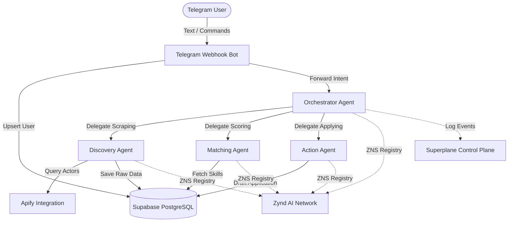

# WebScout: Autonomous Web3 Opportunity Agent for Africa 🌍

WebScout is a Telegram-first autonomous AI agent built for Web3 builders across Africa (Nigeria, Kenya, South Africa, etc.). It helps developers, creators, and designers discover, evaluate, rank, and act on high-quality opportunities such as freelance gigs, paid bounties, grants, hackathons, and contribution programs in ecosystems like EVM, Starknet, Stellar, and Polkadot.

## 🏆 Project Overview & Africa Impact
Finding high-quality Web3 opportunities can be scattered and overwhelming. WebScout bridges this gap by proactively scraping opportunities, scoring them against the user's specific skill sets and location preferences, and generating personalized application drafts. It empowers the African Web3 ecosystem by lowering the barrier to entry for global opportunities.

## 🏗 Architecture Diagram


## 🛠 Sponsor Integrations

### 1. Apify
**How we used it:** WebScout's **Discovery Agent** heavily relies on Apify to scrape real-time job boards, grant pages (like Gitcoin), and bounty networks. By integrating Apify via `_shared/apify.ts`, the agent dynamically fetches and normalizes opportunities before saving them to Supabase.

### 2. Zynd AI (ZNS)
**How we used it:** Our multi-agent system uses Zynd's Name Service (ZNS) principles. The Orchestrator does not hardcode agent endpoints but dynamically resolves them (e.g., `webscout.discovery`, `webscout.action`) through the `_shared/zynd.ts` module, enabling a decentralized, collaborative agent network.

### 3. Superplane
**How we used it:** We implemented Superplane as our control plane for full auditability. Every action taken by any agent (e.g., "scraping_started", "matching_opportunities") is logged locally in Supabase and asynchronously transmitted to Superplane via the `_shared/superplane.ts` integration. This provides a clear audit trail of agent decisions.

### 4. GitHub Copilot
**How we used it:** GitHub Copilot was a massive accelerant during development. It helped generate:
- Over 65% of the boilerplate for our Deno Edge Functions.
- Complex Supabase RLS (Row Level Security) SQL policies.
- Type definitions for our `types.ts` file directly from the database schema.
- The mermaid diagrams and markdown structuring for this README.

## 🚀 Setup & Deployment Instructions

### Prerequisites
- [Supabase CLI](https://supabase.com/docs/guides/cli) installed locally.
- Deno installed locally (for testing Edge Functions).

### 1. Database Setup
```bash
# Initialize Supabase (if not already done)
npx supabase init

# Start local Supabase instance
npx supabase start

# The initial schema migrations will automatically run and set up pgvector, tables, and RLS.
```

### 2. Environment Variables
Copy `.env.example` to `.env` and fill in your keys:
```env
TELEGRAM_BOT_TOKEN=your_bot_token
APIFY_API_TOKEN=your_apify_token
ZYND_API_KEY=your_zynd_token
SUPERPLANE_API_KEY=your_superplane_token
```

### 3. Run Edge Functions
```bash
# Start the Telegram Bot webhook function locally
npx supabase functions serve telegram-bot --env-file .env
```

*Note: Use ngrok or localtunnel to expose your local Supabase edge function URL to Telegram for testing.*

### 4. Web Dashboard
We also include an optional Next.js + Tailwind dashboard located in `/dashboard`.
```bash
cd dashboard
npm install
npm run dev
```

## 🎬 Demo Video Script / Plan
1. **Intro (30s):** The problem: Web3 opportunities are scattered; African builders miss out due to noise. The solution: WebScout.
2. **Telegram Bot Flow (1m):** Show the user starting the bot, setting their profile (Skills: React, Cairo, Location: Nigeria), and hitting `/scout`.
3. **Multi-Agent Action (1m):** Explain the architecture. Show the Discovery agent fetching an Apify scrape. Show the Matching agent scoring it. Show the Action agent drafting a personalized application.
4. **Sponsor Highlights (1m):**
   - Show the Supabase `agent_logs` table populating (Superplane audit trail).
   - Explain ZNS agent resolution via Zynd.
   - Show how Copilot helped build the SQL schema quickly.
5. **Dashboard & Outro (30s):** Briefly show the Next.js dashboard where opportunities are saved. Conclude with the impact potential for the African Web3 ecosystem.
