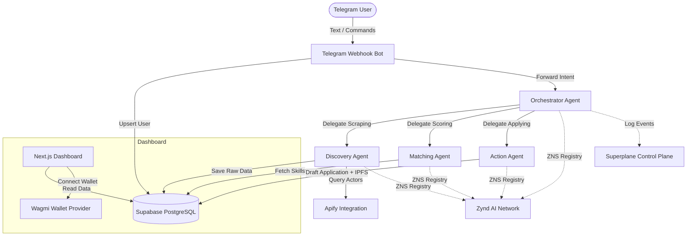

# WebScout: Autonomous Web3 Opportunity Agent for Africa 🌍

WebScout is a Telegram-first autonomous AI agent built for Web3 builders across Africa (Nigeria, Kenya, South Africa, etc.). It helps developers, creators, and designers discover, evaluate, rank, and act on high-quality opportunities such as freelance gigs, paid bounties, grants, hackathons, and contribution programs in ecosystems like EVM, Starknet, Stellar, and Polkadot.

## Impact for Africa

Finding high-quality Web3 opportunities is scattered and overwhelming. African builders face additional challenges: information asymmetry, limited access to global networks, and difficulty tailoring applications to distant opportunities. WebScout bridges this gap by:

- **Proactively scraping** global opportunity sources via Apify
- **Intelligently matching** opportunities to each user's skills, location, and preferences
- **Generating personalized** application drafts using AI
- **Storing everything on-chain** via IPFS when a wallet is linked
- **Providing a full audit trail** via Superplane for trust and transparency

## Architecture Diagram



## Multi-Agent System

WebScout uses a four-agent architecture with clear separation of concerns:

| Agent | Role | Technology |
|-------|------|------------|
| **Orchestrator** | Receives user query, plans, delegates, and aggregates results | Deno + Zynd |
| **Discovery** | Uses Apify to scrape job boards, grant pages, and bounty networks | Apify API |
| **Matching** | Scores opportunities based on user skills, location, and preferences | Heuristic + AI |
| **Action** | Generates personalized application drafts, saves to IPFS | OpenAI + IPFS |

## Sponsor Integrations

### 1. Apify
**How we used it:** WebScout's **Discovery Agent** heavily relies on Apify to scrape real-time job boards, grant pages (like Gitcoin), bounty networks, and developer portals. We integrated Apify via `supabase/functions/_shared/apify.ts` with:

- Proper actor management with polling for completion
- Multiple actor targets for diverse ecosystems (EVM, Starknet, Polkadot)
- Data normalization and deduplication
- Graceful fallback to mock data when actors are unavailable

### 2. Zynd AI (ZNS)
**How we used it:** Our multi-agent system uses Zynd's Name Service (ZNS) for decentralized agent discovery and registration. Each agent registers itself on the Zynd network upon startup via `supabase/functions/_shared/zynd.ts`:

- **Registration**: Agents register with ZNS using human-readable names (e.g., `webscout.discovery`)
- **Discovery**: The Orchestrator resolves agent endpoints dynamically instead of hardcoding URLs
- **Communication**: Agents communicate via Zynd with proper authentication headers
- **Fallback**: Falls back to local registry and environment variables when Zynd is unavailable

### 3. Superplane
**How we used it:** We implemented Superplane as our control plane for full auditability and workflow automation via `supabase/functions/_shared/superplane.ts`:

- **Audit Trail**: Every agent action is logged locally in Supabase and sent to Superplane
- **Event Structure**: Standardized event format with project, agent, user_id, action, payload, and timestamp
- **Resilience**: Logging continues locally even if Superplane is temporarily unavailable
- **Coverage**: All four agents (Orchestrator, Discovery, Matching, Action) log all significant events

### 4. GitHub Copilot
**How we used it:** GitHub Copilot was a massive accelerant during development:

| Feature | Copilot Contribution |
|---------|---------------------|
| **Deno Edge Functions** | Generated ~65% of boilerplate code for all 5 edge functions |
| **Supabase RLS Policies** | Helped craft complex row-level security SQL policies |
| **TypeScript Types** | Generated `types.ts` definitions directly from the database schema |
| **Apify Integration** | Assisted in writing the actor API interaction and polling logic |
| **Zynd Integration** | Helped design the ZNS registration and endpoint resolution patterns |
| **Superplane Integration** | Generated the event transmission and error handling code |
| **README & Diagrams** | Generated the mermaid architecture diagram and markdown structure |
| **Deduplication Logic** | Helped implement URL-based deduplication in the Discovery Agent |

### 5. Web3 & Wagmi
**How we used it:** We integrated wallet connectivity and on-chain storage:

- **Wagmi Provider**: The Next.js dashboard uses Wagmi for Ethereum/Starknet wallet connection
- **Wallet Validation**: Both Ethereum (0x...) and Starknet addresses are validated
- **Session-based Linking**: Users link wallets via the Telegram bot with interactive prompts
- **IPFS Storage**: Generated application drafts are optionally saved to IPFS when a wallet is linked

## Setup & Deployment Instructions

### Prerequisites
- [Supabase CLI](https://supabase.com/docs/guides/cli) installed locally
- Deno installed locally (for testing Edge Functions)
- A Telegram Bot Token from [@BotFather](https://t.me/BotFather)
- API keys for Apify, Zynd AI, and/or Superplane (as needed)

### Quick Start
```bash
# 1. Start all services
./start.sh

# Or manually:
# 2. Start Supabase
npx supabase start

# 3. Set up environment
cp .env.example .env
# Edit .env with your API keys

# 4. Serve the Telegram bot
npx supabase functions serve telegram-bot --env-file .env

# 5. Start the dashboard (in another terminal)
cd dashboard
cp .env.example .env.local
npm run dev
```

### Required Environment Variables
```env
# Supabase (auto-provided when running supabase start)
SUPABASE_URL=http://127.0.0.1:54321
SUPABASE_ANON_KEY=your-local-anon-key
SUPABASE_SERVICE_ROLE_KEY=your-local-service-role-key

# Required for Telegram Bot
TELEGRAM_BOT_TOKEN=your_telegram_bot_token_from_BotFather

# Choose at least one AI provider
OPENAI_API_KEY=your_openai_api_key
# or
GROQ_API_KEY=your_groq_api_key
# or
ANTHROPIC_API_KEY=your_anthropic_api_key

# Required for Apify Integration
APIFY_API_TOKEN=your_apify_api_token

# Required for Zynd AI Integration
ZYND_API_KEY=your_zynd_api_key

# Required for Superplane Integration
SUPERPLANE_API_KEY=your_superplane_api_key

# Optional for IPFS Storage
IPFS_API_KEY=your_pinata_or_ipfs_api_key
```

### Database Migrations
```bash
# Apply the initial schema (includes pgvector, tables, and RLS)
npx supabase db push
```

### Exposing to Telegram
```bash
# Use ngrok to expose your local function to Telegram
ngrok http 54321
# Set the webhook in your bot:
# https://api.telegram.org/bot<TOKEN>/setWebhook?url=<NGROK_URL>/functions/v1/telegram-bot
```

## Demo Video Script / Plan

1. **Intro (30s):** The problem: Web3 opportunities are scattered; African builders miss out due to noise. The solution: WebScout.
2. **Telegram Bot Flow (1m):** Show the user starting the bot, setting their profile (Skills: React, Cairo, Location: Nigeria), and hitting `/scout`.
3. **Multi-Agent Action (1m):** Explain the architecture. Show the Discovery agent fetching an Apify scrape. Show the Matching agent scoring it. Show the Action agent drafting a personalized application.
4. **Sponsor Highlights (1m):**
   - Show the Supabase `agent_logs` table populating (Superplane audit trail)
   - Explain ZNS agent resolution via Zynd
   - Show how Copilot helped build the SQL schema quickly
   - Show wallet linking and IPFS draft storage
5. **Dashboard & Outro (30s):** Open the Next.js dashboard showing real opportunities from Supabase. Conclude with the impact potential for the African Web3 ecosystem.

## Project Structure

```
webscout/
├── supabase/
│   ├── functions/
│   │   ├── _shared/           # Shared utilities
│   │   │   ├── supabase.ts    # Supabase client
│   │   │   ├── apify.ts       # Apify actor runner
│   │   │   ├── zynd.ts        # Zynd AI integration
│   │   │   ├── superplane.ts  # Superplane control plane
│   │   │   ├── web3.ts        # Wallet & IPFS utilities
│   │   │   └── types.ts       # TypeScript type definitions
│   │   ├── telegram-bot/      # Main Telegram bot (grammY)
│   │   ├── agent-orchestrator/ # Orchestration agent
│   │   ├── discovery-agent/   # Discovery agent (Apify)
│   │   ├── matching-agent/    # Matching & valuation agent
│   │   └── action-agent/      # Action agent (drafts + IPFS)
│   ├── migrations/            # Database schema
│   └── config.toml            # Supabase configuration
├── dashboard/                 # Next.js web dashboard
│   └── src/
│       ├── app/               # Dashboard pages
│       ├── components/        # Wagmi provider
│       └── lib/               # Supabase client
├── start.sh                   # One-command startup script
└── README.md
```
